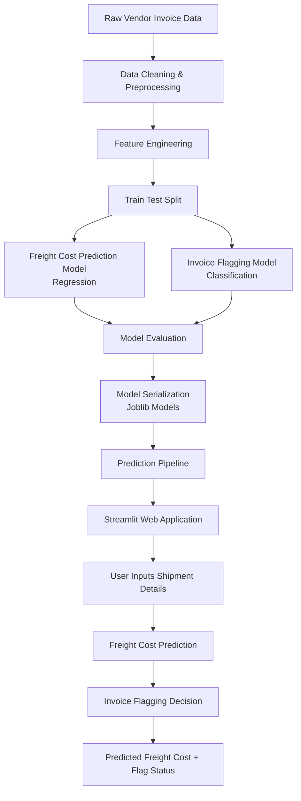

# Vendor_Freight_And_Invoive_Flagging_ML_Project
## 📌 Overview
This project focuses on building a **Machine Learning pipeline to predict freight costs and detect potentially incorrect vendor invoices**.  

The system uses historical vendor transaction data to:

- Predict expected **freight cost** for vendor shipments
- **Flag suspicious invoices** where the billed freight cost deviates from the predicted value
- Provide predictions through a **Streamlit web application**

The goal is to help businesses improve **cost control, auditing, and vendor performance monitoring**.

---

## 🚀 Features

- Freight cost prediction using **Machine Learning regression models**
- Invoice anomaly detection using **classification models**
- Data preprocessing and feature engineering pipeline
- Model training and evaluation scripts
- Serialized trained models for inference
- Interactive **Streamlit application** for real-time predictions

---

## 📂 Project Structure


Vendor_Freight_And_Invoice_Flagging_ML_Project
```
│
├── Invoice_Flagging.ipynb # Exploratory analysis and model development
├── predicting_freight_cost.ipynb # Freight prediction notebook
│
├── train.py # Model training pipeline
├── data_preprocessing.py # Data preprocessing functions
│
├── predict_freight.py # Freight cost prediction script
├── predict_invoice_flag.py # Invoice flagging prediction
│
├── model_evaluation.py # Model performance evaluation
│
├── app.py # Streamlit web application
├── run.bat # Script to launch the app
│
├── predict_freight_model.pkl # Trained regression model
├── predict_invoice_flag.pkl # Trained classification model
├── scaler.pkl # Feature scaling object
│
└── LICENSE
```

---

## ⚙️ Tech Stack

- Python
- Pandas
- NumPy
- Scikit-learn
- Joblib
- Streamlit
- Jupyter Notebook

---
## 🔗 Model Pipeline
```
Data Collection
      │
      ▼
Data Cleaning & Preprocessing
      │
      ▼
Feature Engineering
      │
      ▼
Model Training
      │
      ▼
Freight Cost Prediction Model
Invoice Flagging Model
      │
      ▼
Streamlit Deployment
```

## 🏗 End-to-End ML Architecture




## 🖥 Running the Project

### 1️⃣ Clone the Repository

```
git clone https://github.com/AbhiiisheK990/Vendor_Freight_And_Invoive_Flagging_ML_Project.git
cd Vendor_Freight_And_Invoive_Flagging_ML_Project
```
2️⃣ Install Dependencies
```
pip install -r requirements.txt
```
3️⃣ Run the Streamlit App
```
streamlit run app.py
```
**📊 Example Use Case**

A company receives thousands of vendor invoices every month.

This system helps by:

 - Predicting the expected freight cost

 - Comparing it with the actual invoice value

 - Automatically flagging suspicious invoices for manual review

 - This improves financial control and fraud detection.

**📈 Future Improvements**

 - Add automated anomaly detection

 - Improve model performance with advanced algorithms

 - Deploy as a cloud API

 - Integrate with enterprise ERP systems

**📜 License** 

This project is licensed under the MIT License.

**👨‍💻 Author**

Abhishek Hiremath


